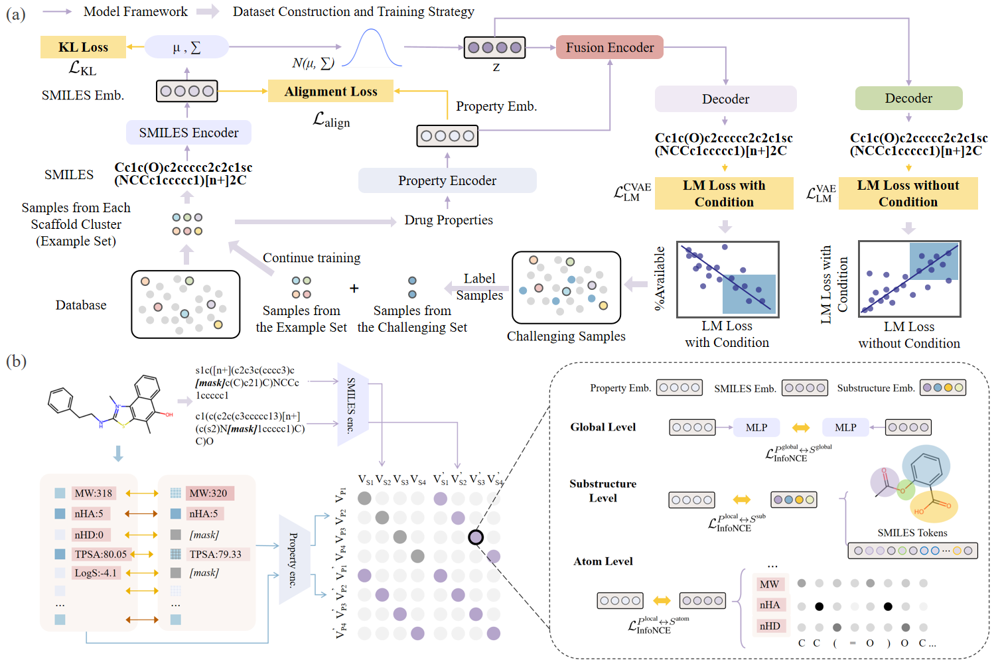

<h1 align="center">  UEMPM  </h1>
<h3 align="center"> A Unified and Data-efficient Molecular Property Modeling Framework via Multi-Level Contrastive Learning </h3>

<div align=center></div>

## :bulb: Introduction

We propose a unified and data-efficient framework called UEMPM to address both challenges. First, we treat molecular structures (represented as SMILES sequences) and molecular properties as two complementary modalities and develop modality-specific data augmentation strategies to facilitate the contrastive learning across modalities. In particular, we introduce a multi-level contrastive learning, which aligns molecular structures and their properties from atom level to whole-molecule level. Second, we propose a data-efficient strategy by selecting representative samples through Scaffold clustering and hard samples via an auxiliary variational auto-encoder (VAE), significantly reducing the required pre-training data. UEMPM achieves outstanding performance across multiple downstream tasks, including property prediction, molecular editing, retrieval, and property-constrained generation. 

## 📕 Requirements

To run the codes, You can configure dependencies by restoring our environment:
```
conda env create -f environment.yaml
```

and then：

```
conda activate my_env
```

## 📚 Resource Download

Download [pretraining data](https://drive.google.com/file/d/1t1Ws-wPYPeeuc8f_SGgnfUCVCzlM_jUJ/view?usp=sharing) and put it into ``./datasets/``.

**Note:** You can find the toy dataset in ``./datasets/toy/``

You can download the pre-trained models: [UEMPM-gene](https://huggingface.co/zjunlp/MolGen-large) and [UEMPM-pre](https://huggingface.co/zjunlp/MolGen-large-opt). Put them into ``./pretrained_models/``

The MoleculeNet dataset can be downloaded from [here](https://drive.google.com/file/d/1IdW6J6tX4j5JU0bFcQcuOBVwGNdX7pZp/view?usp=sharing).

The expected structure of files is:

```
UEMPM
├── datasets 
│   ├── toy                   # toy dataset for a quick start
│   ├── example_set.csv       # set the scaffold levenstain distance to 3
│   ├── challenging_set.csv   # select samples with large reconstruction loss
│   ├── valid.csv             # validation set divided by scaffold
│   └── test.csv              # test set divided by scaffold
├── pretrained_models
│   ├── UEMPM_gene.pth        # pre-training parameters for generation tasks and retrieval tasks
│   └── UEMPM_pred.pth        # pre-training parameters for prediction tasks
├── output                    # generate molecules
├── output                    # molecule candidates
└── vocab_list
    └── zinc.npy                # SELFIES alphabet
``` 

# 🚀 How to run

1. Pre-training
    ```
    python SPMM_pretrain.py --data_path './data/pretrain.txt'
    ```

2. PV-to-SMILES generation
batched: The model takes PVs from the molecules in `input_file`, and generates molecules with those PVs using k-beam search. The generated molecules will be written in `generated_molecules.txt`.

       ```
       python d_pv2smiles_batched.py --checkpoint './Pretrain/checkpoint_SPMM.ckpt' --input_file './data/pubchem_1k_unseen.txt' --k 2
       ```
   
  single: The model takes one query PV and generates `n_generate` molecules with that PV using k-beam search. The generated molecules will be written in `generated_molecules.txt`. Here, you need to build your input PV in the file `p2s_input.csv`. Check the four examples that we included.

       ```
       python d_pv2smiles_single.py --checkpoint './Pretrain/checkpoint_SPMM.ckpt' --n_generate 1000 --stochastic True --k 2
       ```

4. SMILES-to-PV generation
    
    The model takes the query molecules in `input_file`, and generates their PV.

    ```
    python d_smiles2pv.py --checkpoint './Pretrain/checkpoint_SPMM.ckpt' --input_file './data/pubchem_1k_unseen.txt'
    ```

5. MoleculeNet + DILI prediction task

    `d_regression.py`, `d_classification.py`, and `d_classification_multilabel.py`, perform regression, binary classification, and multi-label classification tasks, respectively.

    ```
    python d_regression.py --checkpoint './Pretrain/checkpoint_SPMM.ckpt' --name 'bace'
    python d_classification.py --checkpoint './Pretrain/checkpoint_SPMM.ckpt' --name 'bbbp'
    python d_classification_multilabel.py --checkpoint './Pretrain/checkpoint_SPMM.ckpt' --name 'clintox'
    ```
