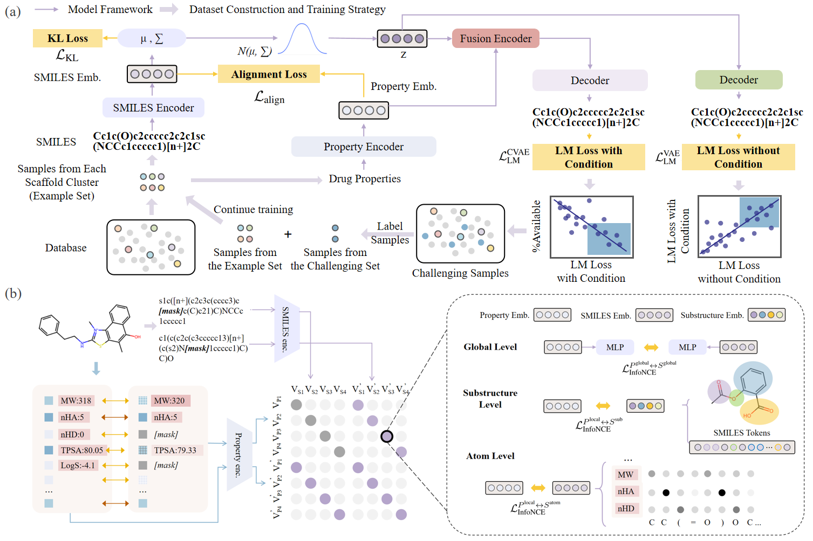

<h1 align="center">  UEMPM  </h1>
<h3 align="center"> A Unified and Data-efficient Molecular Property Modeling Framework via Multi-Level Contrastive Learning </h3>

<div align=center></div>

## :bulb: Introduction

We propose a unified and data-efficient framework called UEMPM to address both challenges. First, we treat molecular structures (represented as SMILES sequences) and molecular properties as two complementary modalities and develop modality-specific data augmentation strategies to facilitate the contrastive learning across modalities. In particular, we introduce a multi-level contrastive learning, which aligns molecular structures and their properties from atom level to whole-molecule level. Second, we propose a data-efficient strategy by selecting representative samples through Scaffold clustering and hard samples via an auxiliary variational auto-encoder (VAE), significantly reducing the required pre-training data. UEMPM achieves outstanding performance across multiple downstream tasks, including property prediction, molecular editing, retrieval, and property-constrained generation. 

## 📕 Requirements

To run the codes, You can configure dependencies by restoring our environment:
```
conda env create -f environment.yaml
```

and then：

```
conda activate my_env
```

## 📚 Resource Download

Download [pretraining data](https://drive.google.com/drive/folders/1BOGG5xSRv4XVAzg8tLSD-hRVq964BmBd?usp=drive_link) and put it into ``./datasets/``.

**Note:** You can find the toy dataset in ``./datasets/toy/``

You can download the pre-trained models: [UEMPM_gene](https://drive.google.com/drive/folders/1dBoiEj8jy0cE1TrBdU7xVBzqkmrPnRsa?usp=sharing) and [UEMPM_pre](https://drive.google.com/drive/folders/1dBoiEj8jy0cE1TrBdU7xVBzqkmrPnRsa?usp=sharing). Put them into ``./pretrained_models/``

**Note:** This may require modifying the path and filename to ensure successful execution.

The MoleculeNet dataset can be downloaded from [here](https://drive.google.com/file/d/1IdW6J6tX4j5JU0bFcQcuOBVwGNdX7pZp/view?usp=sharing).

The expected structure of files is:

```
UEMPM
├── datasets 
│   ├── toy                   # toy dataset for a quick start
│   ├── MoleculeNet           # used for downstream tasks
│   ├── example_set.csv       # set the scaffold levenstain distance to 3
│   ├── challenging_set.csv   # select samples with large reconstruction loss
│   ├── normalize.pkl         # mean and variance of molecular properties
│   ├── pair.csv              # the correlation between properties
│   ├── vocab.pickle          # the complete ChEMBL database
│   ├── s_my_train_53prop.csv # used for RMSD calculation
│   ├── gene.csv              # target properties for the generated molecules
│   ├── valid.csv             # validation set divided by scaffold
│   └── test.csv              # test set divided by scaffold
├── pretrained_models
│   ├── VAE.pth               # pre-training parameters for VAE
│   ├── UEMPM_gene.pth        # pre-training parameters for generation tasks and retrieval tasks
│   └── UEMPM_pred.pth        # pre-training parameters for prediction tasks
├── proputils                 # the main part of the model code is here
├── stutils                   # the main part of the VAE code is here
├── utils                     # data splits, and metric calculations are included here
├── gene.py                   # molecule generation
├── predict.py                # molecule property prediction
└── pretrain.py               # model pre-training
``` 

## 🚀 How to run

1. Pre-training
    ```
    python SPMM_pretrain.py --tr_datapath './datasets/toy/toy.csv' --ddevice "cuda:0" --batch_size "8"
    ```

2. Molecule generation

    ```
    python gene.py --batch_size '1' --gene_N '2000' --k 2
    ```

4. Molecular property prediction

    ```
    python predict.py --task_type 'classification' --dataset 'toxcast' --batch_size '32' --lr '5e-5'
    ```
    For most datasets, this parameter works well. For some datasets, relying on this parameter may cause early stopping too soon. In such cases, reducing the learning rate or increasing the early stopping patience can help ensure the loss decreases to nearly zero, enabling the results to match those reported in the paper.
   
## References

We are grateful for the open-source code provided by these works, which has greatly assisted us. All have been cited in our submitted paper, and we would like to express our thanks again here.

<a id="1">[1]</a>
Zhu H, Zhou R, Cao D, et al. A pharmacophore-guided deep learning approach for bioactive molecular generation[J]. Nature Communications, 2023, 14(1): 6234.

<a id="2">[2]</a>
Zeng X, Xiang H, Yu L, et al. Accurate prediction of molecular properties and drug targets using a self-supervised image representation learning framework[J]. Nature Machine Intelligence, 2022, 4(11): 1004-1016.

<a id="3">[3]</a>
Chang J, Ye J C. Bidirectional generation of structure and properties through a single molecular foundation model[J]. Nature Communications, 2024, 15(1): 2323.

<a id="4">[4]</a>
Li H, Zhao D, Zeng J. KPGT: knowledge-guided pre-training of graph transformer for molecular property prediction[C]//Proceedings of the 28th ACM SIGKDD Conference on Knowledge Discovery and Data Mining. 2022: 857-867.
